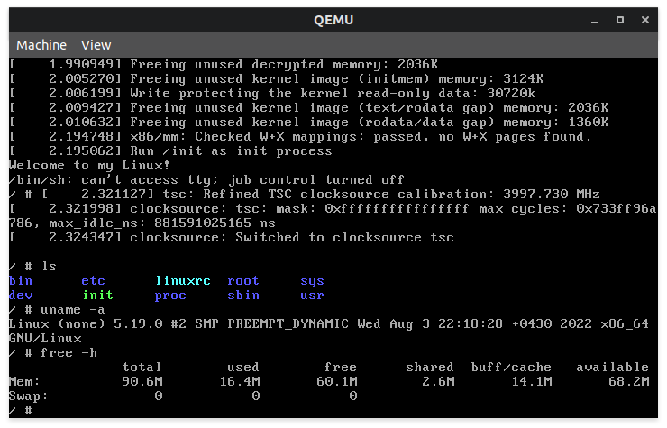

# Linux Kernel
There are several guides for kernel developers and users. These guides can
be rendered in a number of formats, like HTML and PDF. Please read
Documentation/admin-guide/README.rst first.

In order to build the documentation, use ``make htmldocs`` or
``make pdfdocs``.  The formatted documentation can also be read online at:

    https://www.kernel.org/doc/html/latest/

There are various text files in the Documentation/ subdirectory,
several of them using the reStructuredText markup notation.

Please read the Documentation/process/changes.rst file, as it contains the
requirements for building and running the kernel, and information about
the problems which may result by upgrading your kernel.
## 📚  Guides and Documentation
Explore the [`Documentation/`](https://docs.kernel.org/) subdirectory for detailed guides and documentation formatted in reStructuredText.

Before building or running the kernel, review [`Documentation/process/changes.rst`](Documentation/process/changes.rst) for prerequisites and upgrade information.

## ⚙️ Customization
Customize the Linux kernel using configuration options for features, drivers, and subsystems to meet specific hardware or application requirements.

### Benefits
- Optimization for specific hardware
- Reduced kernel image size
- Enhanced security by enabling/disabling features

## 🌍 Open Source
The Linux kernel is open-source under the GNU GPL, fostering a diverse community of contributors and enabling innovation and flexibility.

### Features
- Transparent development process
- Extensive community support and documentation
- Customization for various use cases and hardware platforms

## 🔒 Security
The Linux kernel includes robust security features such as access control, memory protection, and support for advanced security modules.

### Benefits
- Address Space Layout Randomization (ASLR)
- Support for Security-Enhanced Linux (SELinux) and AppArmor
- Regular security audits and patch management

## 📅 Long-Term Support (LTS)
LTS versions of the Linux kernel receive updates and security patches for approximately two years, providing reliability and stability for long-term deployments.

### Benefits
- Stability prioritized over new features
- Extended support for critical infrastructure and business applications
- Smooth upgrade process and community support

## 🚗 Driver Support
The Linux kernel provides in-kernel drivers for a wide range of hardware components and supports third-party drivers for broader hardware compatibility.

### Benefits
- Comprehensive hardware support
- Plug-and-play functionality
- Stable API for driver development
